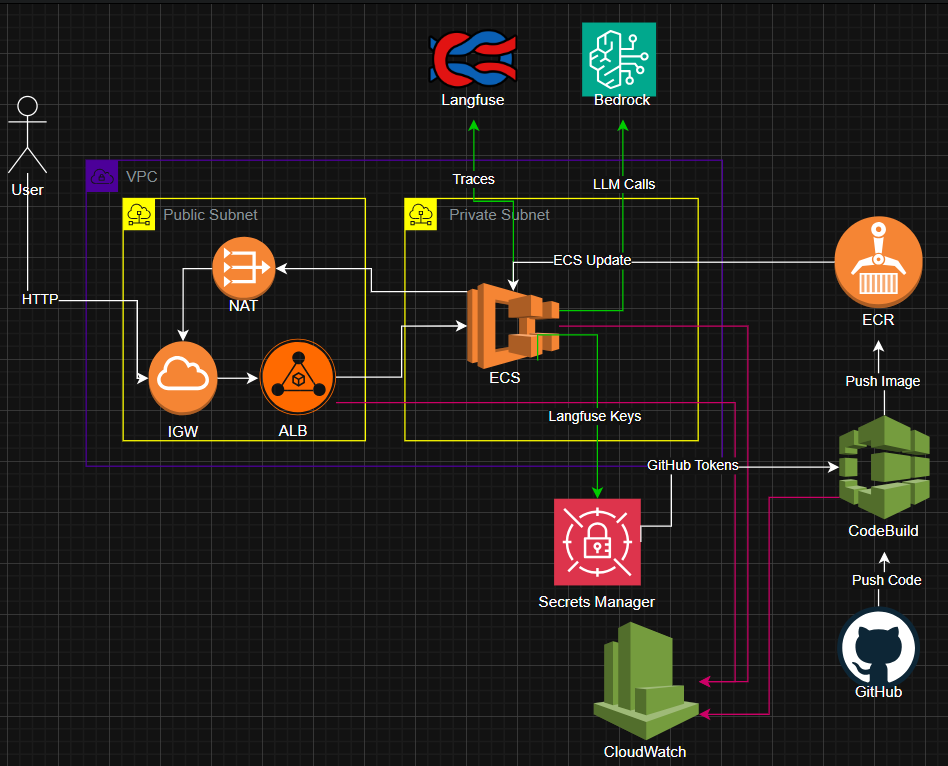

# Technical Test AI Swiss Life - Data Scientist - MWC

Welcome to this project combining generative Artificial Intelligence and Infrastructure as Code. This solution enables structured data to be extracted from unstructured sources via LLMs (Amazon Bedrock), all powered by a modern and secure cloud architecture.

## 🏗️ Global Architecture




## Key components:
* **Application:** FastAPI orchestrated by uv.

* **AI:** Amazon Bedrock for LLM inference.

* **Infrastructure:** Serverless deployment via AWS ECS Fargate.

* **CI/CD:** Automated pipeline with AWS CodeBuild & GitHub Webhooks.

* **Observability:** Full tracing of LLM calls with Langfuse.

* **Registry:** Amazon ECR for private Docker image hosting and versioning.

* **Security:** AWS Secrets Manager for encrypted storage of API keys and GitHub tokens.

* **Networking:** VPC Subnets (Public/Private) and NAT Gateway for secure environment isolation.

* **Traffic Management:** AWS Application Load Balancer (ALB) for single entry point and health monitoring.

* **Logging:** Amazon CloudWatch for centralized application, build, and infrastructure logs.


## 📂 Project structure

```text
.
├── assets/             # Useful files
├── app/                # FastAPI source code & business logic
│   ├── src/            # API entry points and LLM services
│   ├──baml_src/        # Core LLM logic (Boundary ML)
│   ├── Dockerfile      # Application containerisation
│   ├── unit_tests.py   # Application unit testing
│   └── pyproject.toml  # Dependency management with uv
├── terraform/          # Infrastructure as Code (AWS)
├── buildspec.yml       # Build instructions for AWS CodeBuild
```

## ⚙️ Deployment Lifecycle

* **Infrastructure:** Terraform creates the network (VPC) and services. A Bootstrap script performs the first `Docker` push to `Amazon ECR`.

* **Continuous Integration:** With each git `push` to the master branch, a webhook triggers `AWS CodeBuild`.


* **Continuous Deployment:** If the tests pass, a new Docker image is created and deployed to `ECS Fargate` via a rolling update (zero service interruption).

## 💡 How to use this repository?
* To understand and modify the **application**: See the [app's README](./app/README.md).

* To understand and modify the **infrastructure**: See the [terraform README](./terraform/readme.md).

## 🔗 Live Demo & Documentation
The application is currently deployed and accessible via AWS Application Load Balancer (ALB). You can test the API and view its interactive documentation at the following addresses:

API Endpoint : http://wacef-project-alb-1819695819.eu-west-1.elb.amazonaws.com/

Swagger UI (Docs) : http://wacef-project-alb-1819695819.eu-west-1.elb.amazonaws.com/docs

ReDoc : http://wacef-project-alb-1819695819.eu-west-1.elb.amazonaws.com/redoc